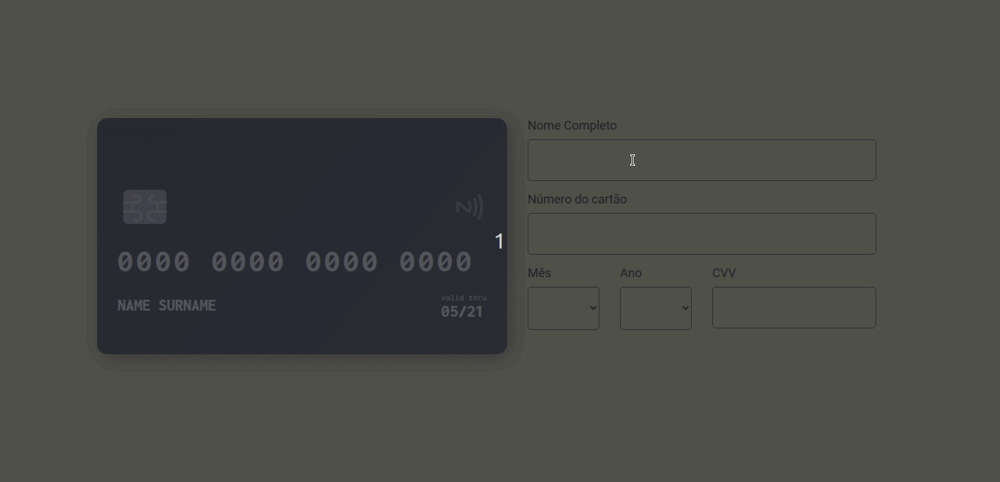

# ✅ Componente de cartão de crédito
🚀 Componente onde podemos digitar os valores em um formulário e seus dados serão refletidos em uma animação no cartão de crédito.

<h1 align="center">
  
</h1>

### 🛠 Tecnologias usadas

As seguintes ferramentas foram usadas na construção do projeto:

* React
* TypeScript
* Styled components

### ✨ Pré-requisitos

Para rodar o projeto na máquina você precisará do Git e do node.js/yarn. Além disso, é bom ter um editor instalado para trabalhar como VSCode.

```bash
# Clonar o repositório
$ git clone https://github.com/uismalopes/animation-credit-card.git

# Acesse a pasta animation-credit-card
$ cd animation-credit-card

# Instale as dependências
$ yarn install

# Execute a aplicação
$ yarn start

# Abrirá uma nova janela com o projeto rodando
```